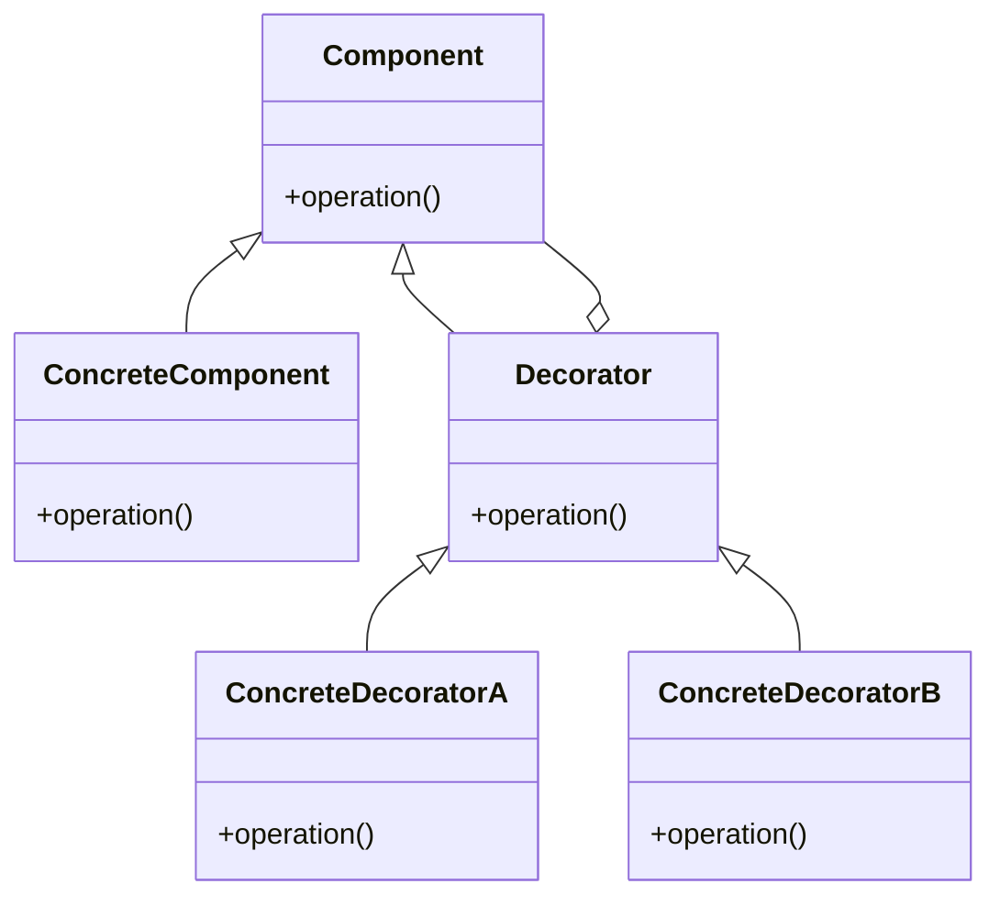

```mermaid
classDiagram
    class Component {
        +operation()
    }

    class ConcreteComponent {
        +operation()
    }

    class Decorator {
        +operation()
    }

    class ConcreteDecoratorA {
        +operation()
    }

    class ConcreteDecoratorB {
        +operation()
    }

    Component <|-- ConcreteComponent
    Component <|-- Decorator
    Decorator o-- Component
    Decorator <|-- ConcreteDecoratorA
    Decorator <|-- ConcreteDecoratorB
```
