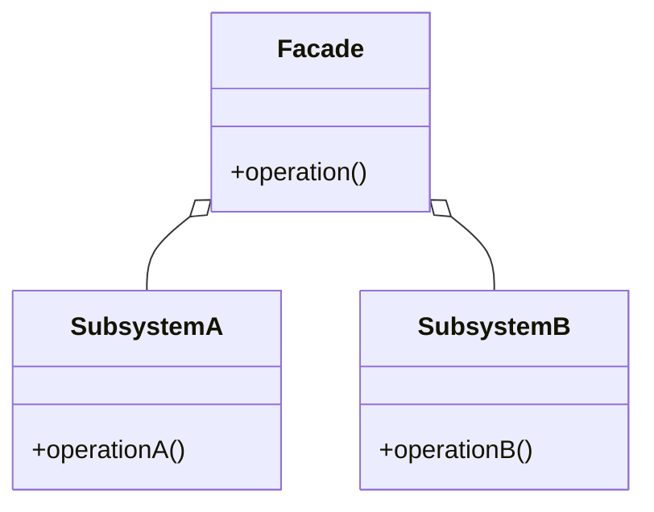

```mermaid
classDiagram
    class Facade {
        +operation()
    }

    class SubsystemA {
        +operationA()
    }

    class SubsystemB {
        +operationB()
    }

    Facade o-- SubsystemA
    Facade o-- SubsystemB
```
