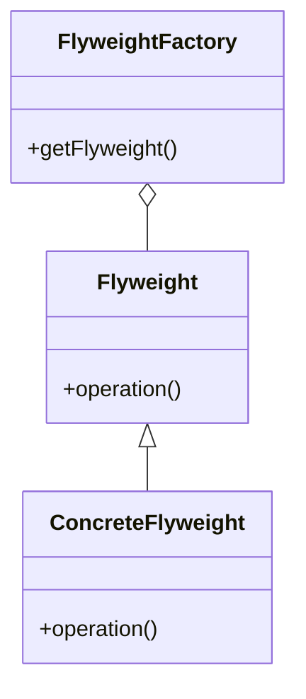

# Flyweight

The **Flyweight** pattern uses sharing to support efficiently a large number of fine-grained objects. This pattern is useful when you have a large number of objects that share common state, allowing to reduce memory usage by sharing.

## Diagram

## Example

In this directory, you can find examples of how to implement the pattern in **C#** and **Python**, as well as a **Mermaid** diagram illustrating the basic structure of the pattern.

- **C#**: Example with classes implementing the Flyweight pattern to reduce memory usage by sharing objects.
- **Python**: A similar example that shows how to use the Flyweight pattern to reduce memory usage by sharing common state.

**SPANISH VERSION / VERSIÓN EN ESPAÑOL:** For the Spanish version of this file, **click [here](README_ES.md)**.
