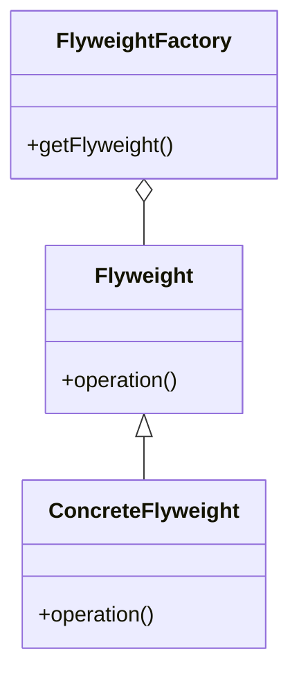

# Flyweight

El patrón **Flyweight** utiliza el uso compartido para soportar eficientemente un gran número de objetos de grano fino. Este patrón es útil cuando se tiene una gran cantidad de objetos que comparten estado común, permitiendo reducir el uso de memoria mediante el uso compartido.

## Diagrama

## Ejemplo

En este directorio, puedes encontrar ejemplos de cómo implementar el patrón en **C#** y **Python**, así como un diagrama en **Mermaid** que ilustra la estructura básica del patrón.

- **C#**: Ejemplo con clases que implementan el patrón Flyweight para reducir el uso de memoria mediante el uso compartido de objetos.
- **Python**: Ejemplo similar que muestra cómo usar el patrón Flyweight para reducir el uso de memoria compartiendo estado común.

**SPANISH VERSION / VERSIÓN EN ESPAÑOL:** Para la versión en inglés de este archivo, haz clic [aquí](README.md).
