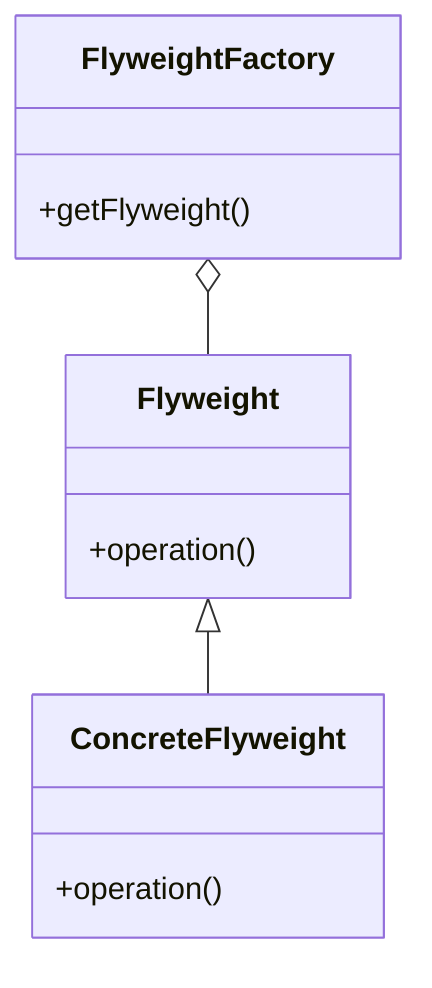

```mermaid
classDiagram
    class Flyweight {
        +operation()
    }

    class ConcreteFlyweight {
        +operation()
    }

    class FlyweightFactory {
        +getFlyweight()
    }

    FlyweightFactory o-- Flyweight
    Flyweight <|-- ConcreteFlyweight
```
