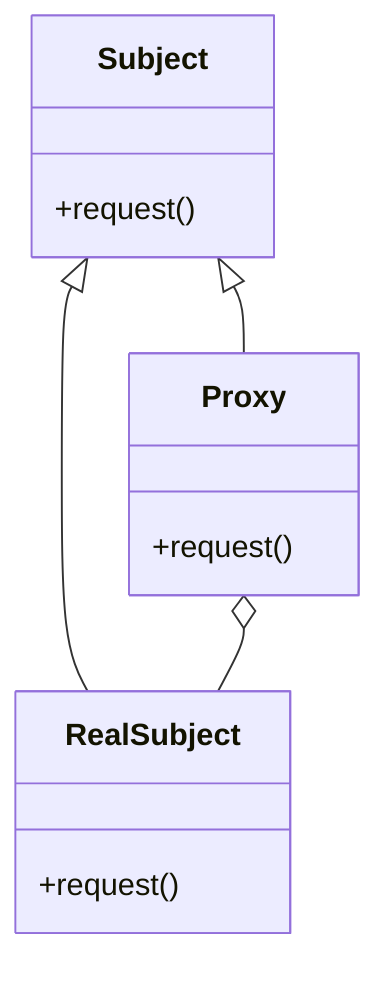

# Proxy

The **Proxy** pattern provides a surrogate or placeholder for another object to control access to it. A proxy can add additional functionality such as access control, caching, or logging operations before delegating the request to the real object.

## Diagram

## Example

In this directory, you can find examples of how to implement the pattern in **C#** and **Python**, as well as a **Mermaid** diagram illustrating the basic structure of the pattern.

- **C#**: Example with classes implementing the Proxy pattern to control access to a real object.
- **Python**: A similar example that shows how to use a proxy to add additional functionality before accessing the real object.

**SPANISH VERSION / VERSIÓN EN ESPAÑOL:** For the Spanish version of this file, **click [here](README_ES.md)**.
