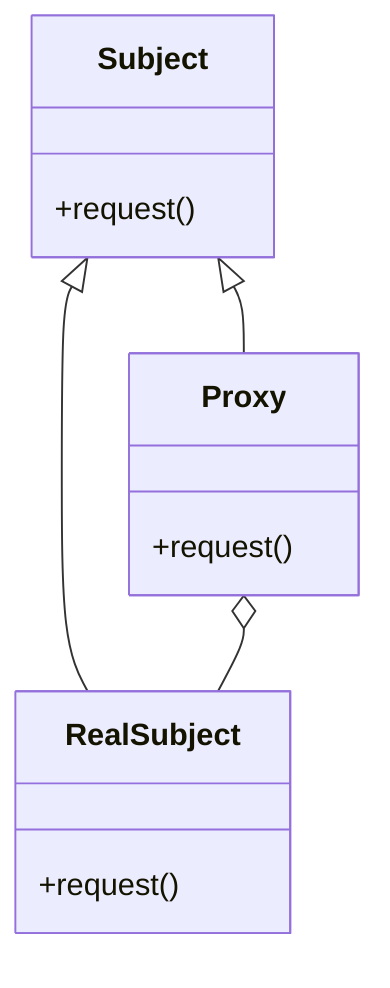

```mermaid
classDiagram
    class Subject {
        +request()
    }

    class RealSubject {
        +request()
    }

    class Proxy {
        +request()
    }

    Subject <|-- RealSubject
    Subject <|-- Proxy
    Proxy o-- RealSubject
```
