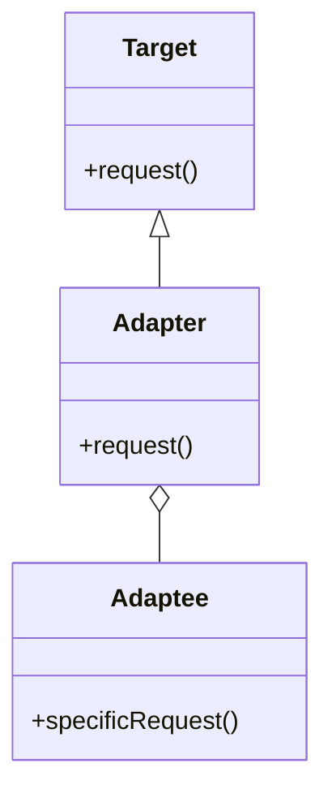

# Adapter

El patrón **Adapter** convierte la interfaz de una clase en otra interfaz que el cliente espera. Este patrón permite que las clases que no podrían trabajar juntas debido a interfaces incompatibles puedan hacerlo.

## Diagrama

## Ejemplo

En este directorio, puedes encontrar ejemplos de cómo implementar el patrón en **C#** y **Python**, así como un diagrama en **Mermaid** que ilustra la estructura básica del patrón.

- **C#**: Ejemplo con clases que implementan el patrón Adapter para convertir una interfaz incompatible en otra compatible.
- **Python**: Ejemplo similar que muestra cómo hacer que clases con interfaces incompatibles trabajen juntas usando el patrón Adapter.

**SPANISH VERSION / VERSIÓN EN ESPAÑOL:** Para la versión en inglés de este archivo, haz clic [aquí](README.md).
