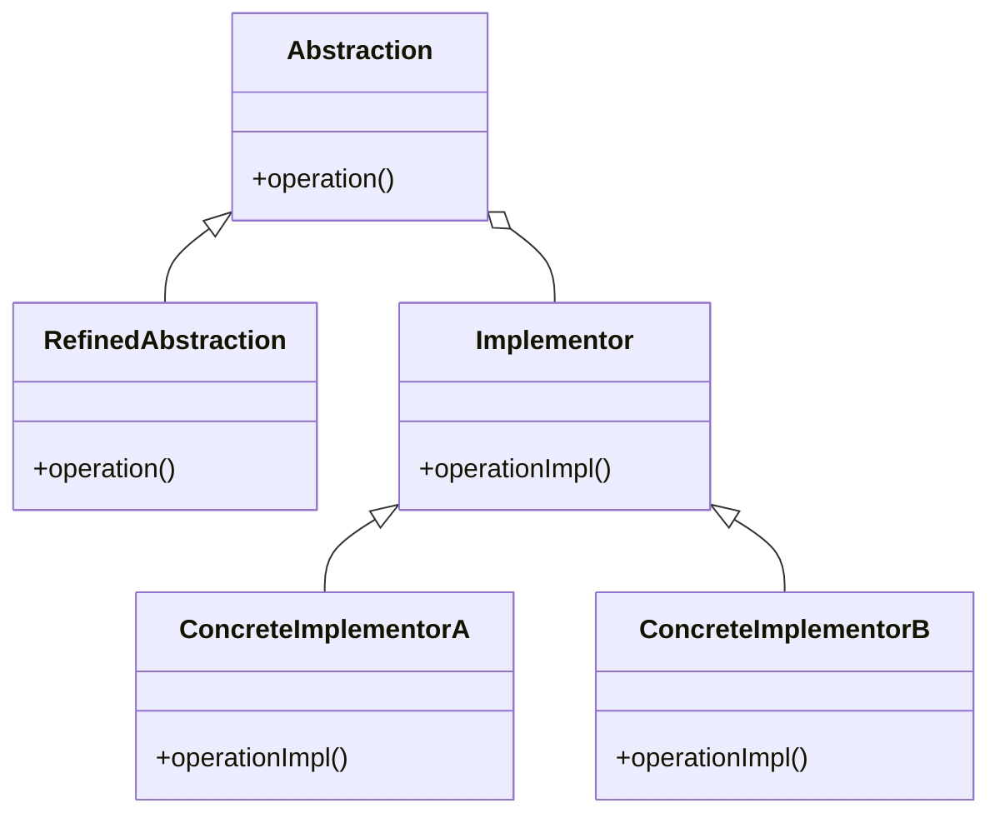

```mermaid
classDiagram
    class Abstraction {
        +operation()
    }

    class RefinedAbstraction {
        +operation()
    }

    class Implementor {
        +operationImpl()
    }

    class ConcreteImplementorA {
        +operationImpl()
    }

    class ConcreteImplementorB {
        +operationImpl()
    }

    Abstraction o-- Implementor
    Abstraction <|-- RefinedAbstraction
    Implementor <|-- ConcreteImplementorA
    Implementor <|-- ConcreteImplementorB
```
