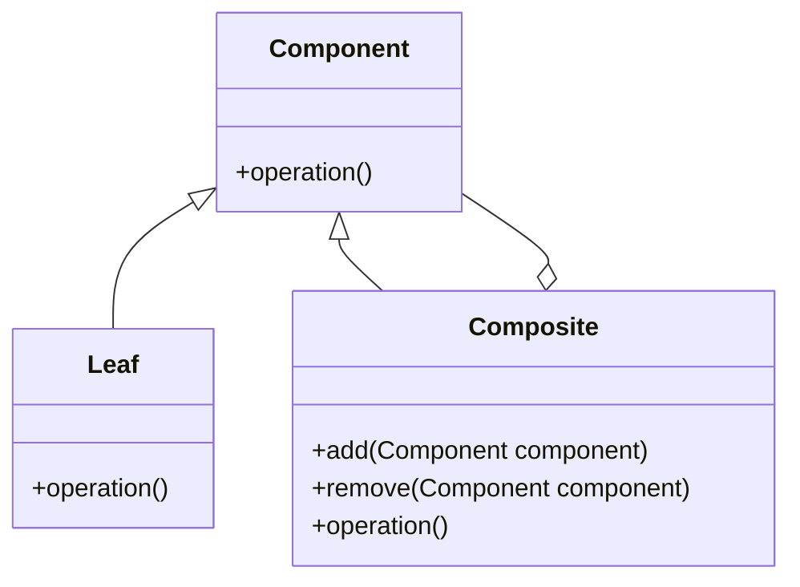

# Composite

The **Composite** pattern allows clients to treat individual objects and compositions of objects uniformly. This pattern is useful when individual objects and their containers need to be treated the same way.

## Diagram

## Example

In this directory, you can find examples of how to implement the pattern in **C#** and **Python**, as well as a **Mermaid** diagram illustrating the basic structure of the pattern.

- **C#**: Example with classes implementing the Composite pattern to treat individual objects and compositions uniformly.
- **Python**: A similar example that shows how to treat individual components and compositions uniformly using the Composite pattern.

**SPANISH VERSION / VERSIÓN EN ESPAÑOL:** For the Spanish version of this file, **click [here](README_ES.md)**.
