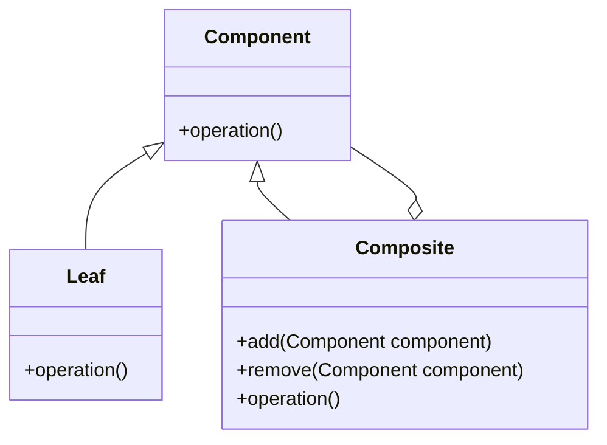

# Composite

El patrón **Composite** permite a los clientes tratar de manera uniforme objetos individuales y compuestos. Este patrón es útil cuando los objetos individuales y sus contenedores deben ser tratados de la misma manera.

## Diagrama

## Ejemplo

En este directorio, puedes encontrar ejemplos de cómo implementar el patrón en **C#** y **Python**, así como un diagrama en **Mermaid** que ilustra la estructura básica del patrón.

- **C#**: Ejemplo con clases que implementan el patrón Composite para tratar objetos individuales y compuestos de la misma manera.
- **Python**: Ejemplo similar que muestra cómo tratar componentes individuales y compuestos de manera uniforme usando el patrón Composite.

**SPANISH VERSION / VERSIÓN EN ESPAÑOL:** Para la versión en inglés de este archivo, haz clic [aquí](README.md).
