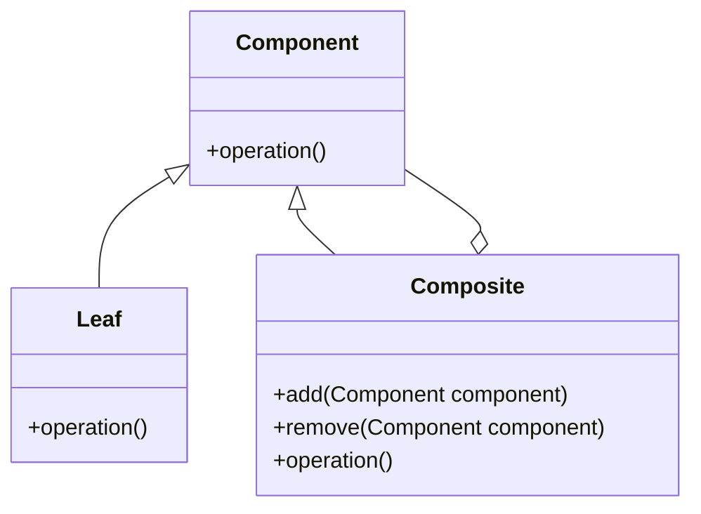

```mermaid
classDiagram
    class Component {
        +operation()
    }

    class Leaf {
        +operation()
    }

    class Composite {
        +add(Component component)
        +remove(Component component)
        +operation()
    }

    Component <|-- Leaf
    Component <|-- Composite
    Composite o-- Component
```
