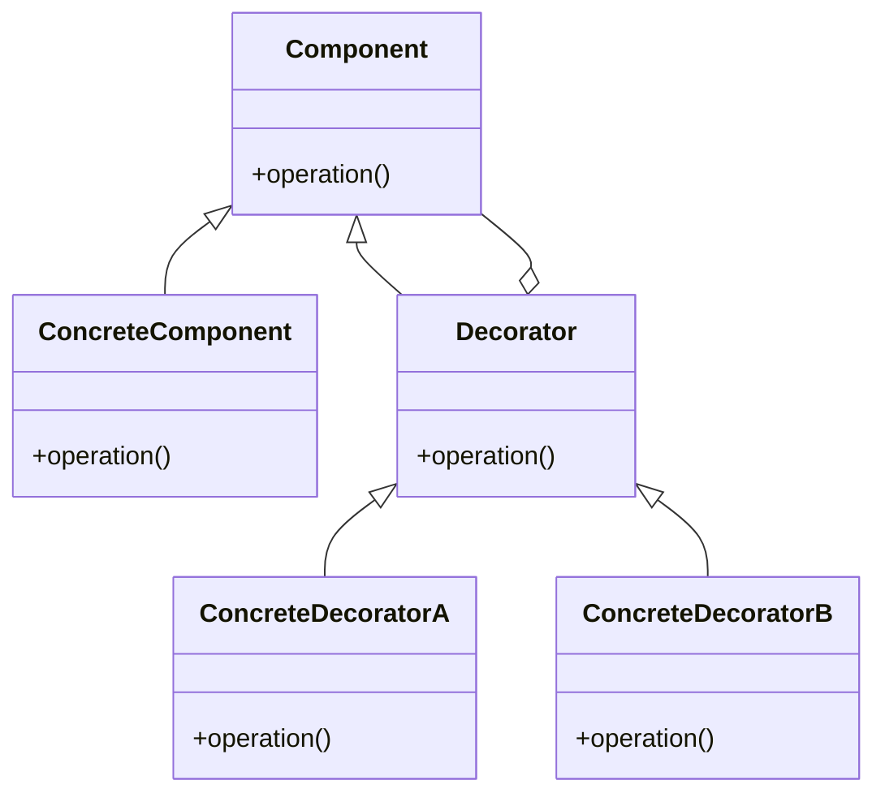

# Decorator

The **Decorator** pattern allows behavior to be added to individual objects, either statically or dynamically, without affecting the behavior of other objects of the same type. This pattern is useful when you want to add responsibilities to objects in a flexible way.

## Diagram

## Example

In this directory, you can find examples of how to implement the pattern in **C#** and **Python**, as well as a **Mermaid** diagram illustrating the basic structure of the pattern.

- **C#**: Example with classes implementing the Decorator pattern to dynamically add additional behavior to objects.
- **Python**: A similar example that shows how to decorate objects with additional responsibilities using the Decorator pattern.

**SPANISH VERSION / VERSIÓN EN ESPAÑOL:** For the Spanish version of this file, **click [here](README_ES.md)**.
