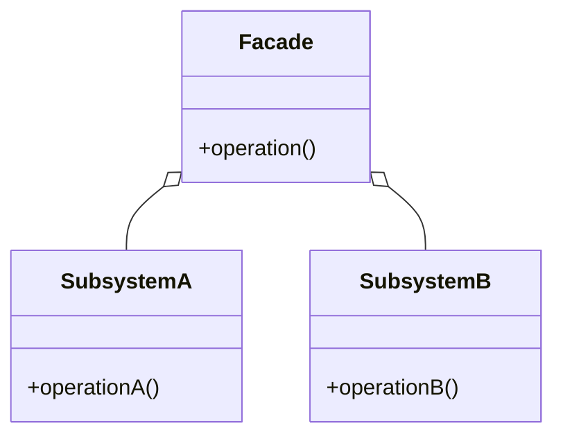

# Facade

The **Facade** pattern provides a unified interface to a set of interfaces in a subsystem. The Facade pattern defines a high-level interface that makes the subsystem easier to use.

## Diagram

## Example

In this directory, you can find examples of how to implement the pattern in **C#** and **Python**, as well as a **Mermaid** diagram illustrating the basic structure of the pattern.

- **C#**: Example with classes implementing the Facade pattern to simplify interaction with complex subsystems.
- **Python**: A similar example that shows how to use a facade to simplify access to a set of subsystems.

**SPANISH VERSION / VERSIÓN EN ESPAÑOL:** For the Spanish version of this file, **click [here](README_ES.md)**.
