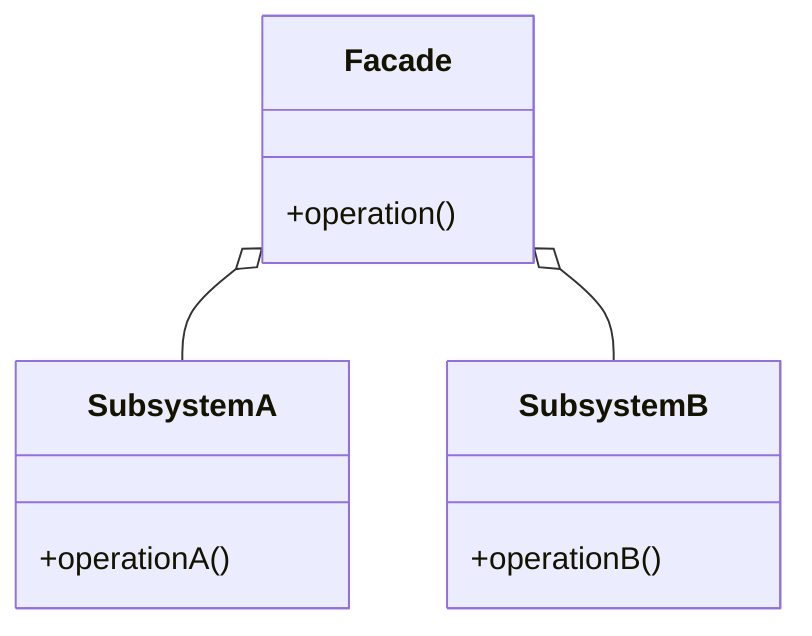

# Facade

El patrón **Facade** proporciona una interfaz unificada para un conjunto de interfaces en un subsistema. El patrón Facade define una interfaz de alto nivel que hace que el subsistema sea más fácil de usar.

## Diagrama

## Ejemplo

En este directorio, puedes encontrar ejemplos de cómo implementar el patrón en **C#** y **Python**, así como un diagrama en **Mermaid** que ilustra la estructura básica del patrón.

- **C#**: Ejemplo con clases que implementan el patrón Facade para simplificar la interacción con subsistemas complejos.
- **Python**: Ejemplo similar que muestra cómo usar una fachada para simplificar el acceso a un conjunto de subsistemas.

**SPANISH VERSION / VERSIÓN EN ESPAÑOL:** Para la versión en inglés de este archivo, haz clic [aquí](README.md).
