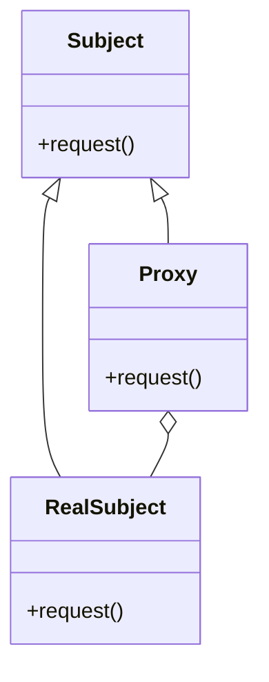

# Proxy

El patrón **Proxy** proporciona un sustituto o representante de otro objeto para controlar el acceso a este. Un proxy puede agregar funcionalidad adicional, como control de acceso, caché, o registro de operaciones, antes de delegar la solicitud al objeto real.

## Diagrama

## Ejemplo

En este directorio, puedes encontrar ejemplos de cómo implementar el patrón en **C#** y **Python**, así como un diagrama en **Mermaid** que ilustra la estructura básica del patrón.

- **C#**: Ejemplo con clases que implementan el patrón Proxy para controlar el acceso a un objeto real.
- **Python**: Ejemplo similar que muestra cómo usar un proxy para agregar funcionalidad adicional antes de acceder al objeto real.

**SPANISH VERSION / VERSIÓN EN ESPAÑOL:** Para la versión en inglés de este archivo, haz clic [aquí](README.md).
